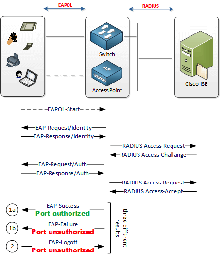

# 802.1x Configuration with Nornir

The purpose of this script is to automatically configure all commands in the global configuration mode to enable 802.1x Authentication. After that, all the necessary settings on the interface level will be done on a per interface basis. The script detects which interfaces are present and which interfaces are actually access ports, and only access ports are configured. All these actions will be done in parallel on multiple devices.

The script achieves the following:
* Configures all necessary global settings for 802.1x on IOS-based Devices.
* Configures all necessary interface configurations based on the description and interface type.
* Adds the device to ISE with all secrets and necessary groups.

